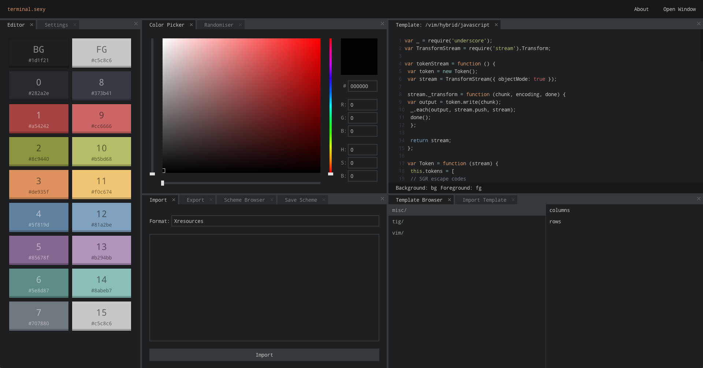
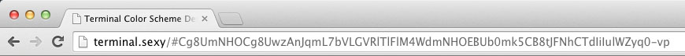
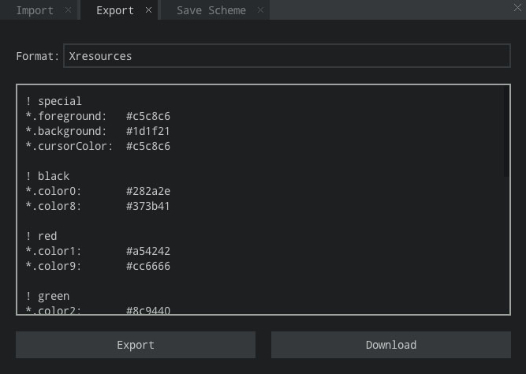
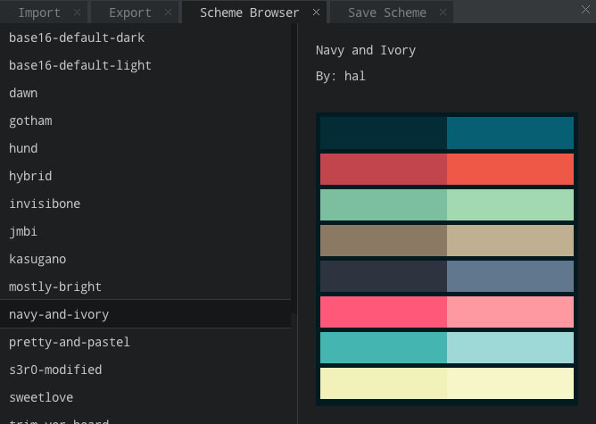
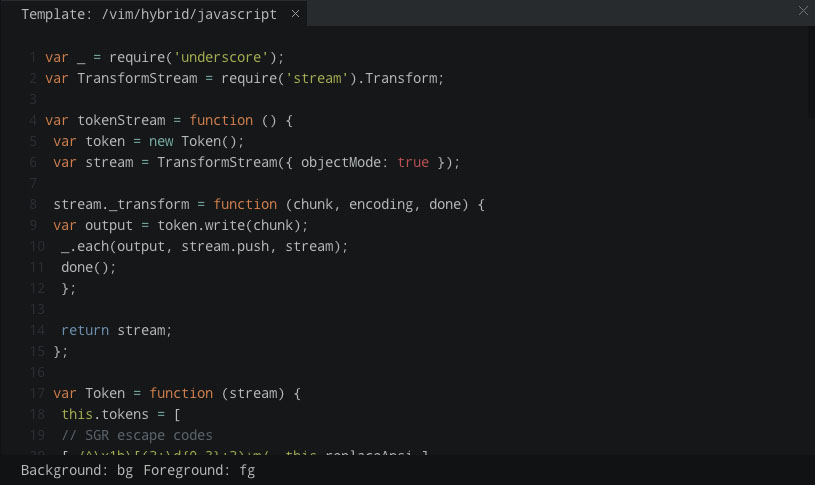
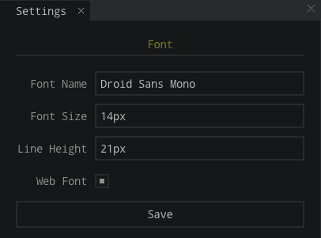

# terminal.sexy

> Design, edit and share terminal colorschemes.

## Features

### URL Sharing

Share your color scheme by copying the URL. 

http://terminal.sexy/#Cg8UmNHOCg8UwzAnJqmL7bVLGVRlTlFlM4WdmNHOEBUb0mk5CB8tJFNhCTdIiIulWZyq0-vp

### Import and Export

Uses the [termcolors](https://github.com/stayradiated/termcolors) library.

Import from:

- Xresources
- Termite
- iTerm (works best with srgb themes)

Export to:

- Chrome Secure Shell
- Gnome Terminal
- Guake Terminal
- iTerm
- Konsole
- Linux console
- lxterminal
- MinTTY
- PuTTY
- Terminal.app
- Terminator
- Termite
- XFCE4 Terminal
- Xresources

### Scheme Browser

Load a pre-made color scheme.

The file browser is based on [Ranger](http://ranger.nongnu.org/).

Use hkjl (or arrowkeys) to move and press enter to open a scheme or template.

### Templates

Templates are like terminal screenshots.

They allow you to see exactly what a color scheme looks like in the terminal.

You can also hover over any text to see what the foreground/background colors are set to.

Create your own templates by using tmux and running the following command:

	capture-pane -eJ; save-buffer ~/tmux.txt; delete-buffer

### Settings

You can currently set the font family, size and line-height.

It cans also use any font on [Google Web Fonts](http://google.com/fonts).
(Just make sure you use the exact same case: `Droid Sans Mono` but not `droid sans mono`)

## License

MIT
